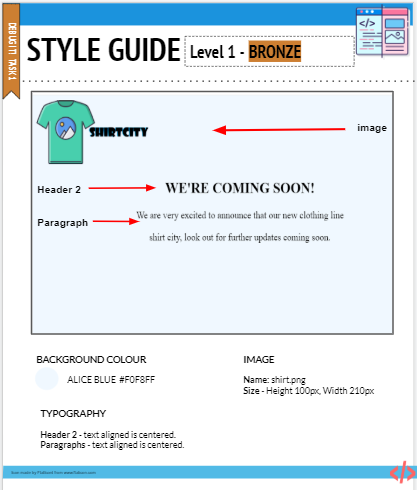

# Shirt City Landing Page: Debug

Shirt City is a new clothing line. The founder designed what the page should look like, and tried to build it on their own, but their code has some issues.

Help Shirt City fix the bugs!

## Your Task

There are **four errors** in `index.html`.  Your task is to identify and fix errors. The image `ShirtCityStyleGuide.png` explains what the site is supposed to look like and what elements to use. Use the image to help you identify bugs in the current site.

You can use the file `errorReporting.txt` to take notes about the bugs. For each bug you find, write what was wrong and how you fixed it.

## Steps

1. Click run to see the current site
2. Click the style guide to see how the site is supposed to look.  
3. Compare it to the design and note the differences you see
4. Find and fix each of the four bugs in index.html. As you do, write down what was wrong in `errorReporting.txt`.

Once you have **debugged** the code, your completed website should look like this...

Don't forget to click Submit!

**Attribution**

This exercise was adapted from "Learners: Debug Bronze" from the [Replit Curriculum Hub](https://replit.com/curriculum/Intro-to-HTML-and-CSS). Thanks Replit!